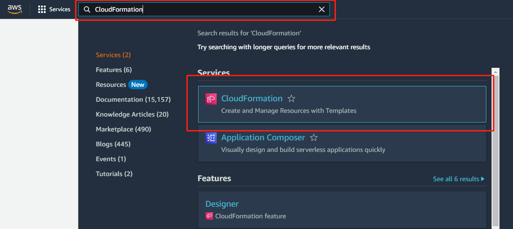
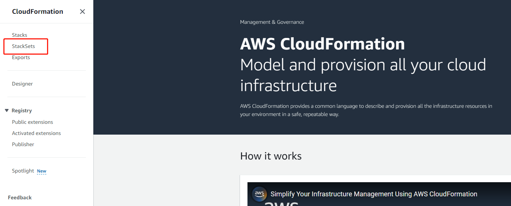
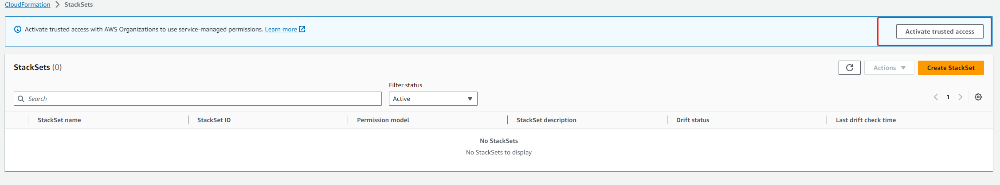
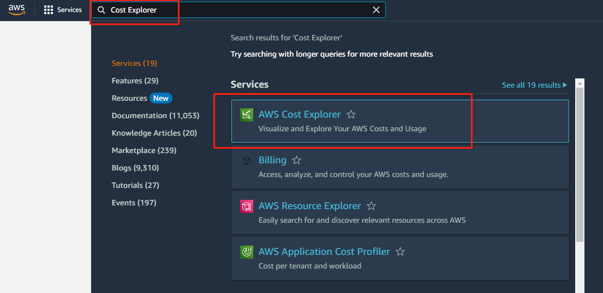
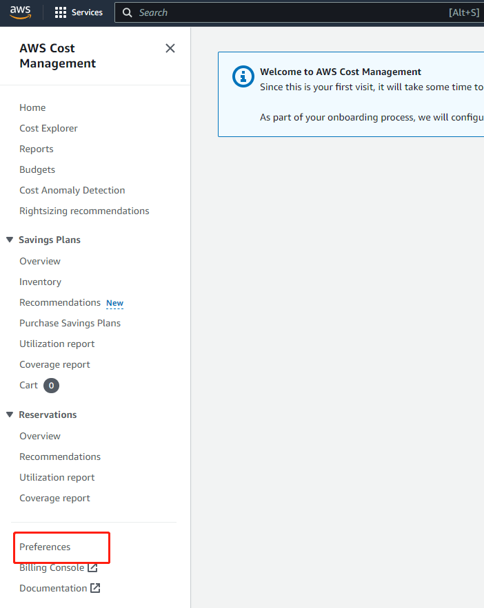
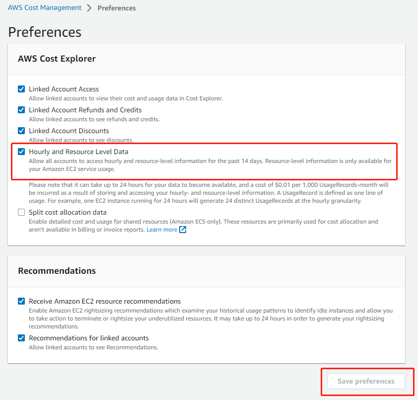

## Table of Contents
- [Introduction](#introduction)
- [Four pillars of Optima](#pillars-of-optima)
  - [Autopilot](#autopilot)
  - [ClariSpend](#clarispend)
  - [Saving Bot](#saving-bot)
  - [Infra Copilot](#infra-copilot)
- [Supported Platforms](#supported-platforms)
- [Prerequisites](#prerequisites)
- [AWS Marketplace Subscription](#aws-marketplace-subscription)
- [AWS Account Connection](#aws-account-connection)
- [Slack Integration](#slack-integration)
- [Product Removal](#product-removal)

  
## Introduction

Cloud optimization can be a time and resource consuming process. Our AI-powered product - Optima - discovers unnecessary AWS spending and eliminates them. We free up your engineering team to focus on what matters most: building the product. Optima automates instance rightsizing, reserved instances trading, savings plans managing, and intelligently shutting down unused instances. Optima acts on real-time saving opportunities and provides easy-to-access actionable notifications directly within Slack. (Support for other platforms is coming soon). In addition, you will be able to manage inventories and generate visualizations and reports using our web portal.

## Pillars of Optima

### Autopilot
Intelligently trades reserved instances and manages savings plans on your behalf by monitoring and forecasting your usage. Unlike AWS recommendations, Autopilot keeps track of RI transactions and updates quickly based on the latest information. Autopilot also takes both savings plans and reserved instances into account when determining the optimal action, a feature not currently available in AWS.

### ClariSpend
Provides daily billing, utilization, and savings reports with weekly trend data, grouped by accounts and services. ClariSpend also detects and highlights irregularities in your AWS usage to help you detect anomalies and react early. Through our comprehensive reporting, you will be able to understand and stay up to date on your AWS usage and how much we are saving for you.

### Saving Bot
Intelligently shuts down and rightsizes EC2 instances with human supervision. Saving bot monitors your EC2 instances and notifies you of under-utilized ones that eat away your cloud costs. Saving bot can be configured to automatically shut down some instances, while only acting after human confirmation on instances that are risky to shut down. Rightsizing adjusts the instance type to match the usage, without harming or altering the instance's content.

### FAI (Coming soon)
A collection of AI assitants that offer capabilities beyond those of ChatGPT.

## Integrating Optima with your AWS organization

### Stage 0: Before we start

Have the following handy:

1. Access to your organization's management account credentials and management console login

2. A technical memeber of your team to review the process (strongly recommended)

3. Contact Forma Cloud support to get the following environment variables:

   ```bash
   export FORMACLOUD_PRINCIPAL=xxx  # The IAM Principal that has permission to your account.
   export FORMACLOUD_ID=xxx  # The customer ID that syncs your account.
   export FORMACLOUD_EXTERNALID=xxx  # The external ID that authenticates your account.
   export FORMACLOUD_EVENT_BUS_ARN=xxx  # The EventBus to receive EC2 instance events.
   ```

4. A terminal to run [AWS CLI](https://docs.aws.amazon.com/cli/latest/userguide/getting-started-install.html). You can use one of the following methods:
   * A MacOS or Linux terminal with [jq](https://stedolan.github.io/jq/download/) and [AWS CLI](https://docs.aws.amazon.com/cli/latest/userguide/getting-started-install.html) installed.
   * Start [AWS CloudShell](https://aws.amazon.com/cloudshell/) from your management account.

5. If you are using a local terminal, please authenticate it with your management account credentials:
   * [How to authenticate CLI.]("https://docs.aws.amazon.com/cli/latest/userguide/cli-authentication-user.html)
   * You can check if you are authenticated by running the following command. If the printed "Account" is the one of your management account, you are good to go.
      ```bash
      aws sts get-caller-identity
      ```
      
6. Check if you have this IAM role 
   ```
   CloudWatch-CrossAccountSharingRole
   ``` 
   by running
   ```
   aws iam list-roles | grep CloudWatch-CrossAccountSharingRole
   ```
   If details about this role is returned, you have it.


### Stage 1: Prepare your AWS organization:

1. Enable [AWS Organization](https://docs.aws.amazon.com/organizations/latest/userguide/orgs_tutorials_basic.html). 
 
2. Enable trusted access with AWS Organization   
   * Sign into AWS console as an administrator of the management account at https://console.aws.amazon.com/
   * Open the AWS CloudFormation console. 
      
   * From the navigation pane on the left, choose StackSets. If trusted access is disabled, a banner displays that prompts you to enable trusted access.
       
   
   * Click Enable trusted access. a success banner will show:
      
3. [Register as a seller](https://formacloud.slab.com/posts/register-as-a-seller-account-e9jt65z4) in the Reserved Instance Marketplace. This needs to be done using the root account in the organization management account. This is the only way we can sell Reserved Instances on your behalf when you don't need them.

4. Enable hourly usage data in AWS Cost Explorer. 

   * Sign into AWS console as an administrator of the management account at https://console.aws.amazon.com/.
   * Go to Cost Explorer.
      
   * From the navigation pane on the left, go to Preferences.
      
   
   * Check "Hourly and Resource Level Data" and click Save.
      


   * Hourly usage data costs $0.0072 per month for each EC2 instance. For example, if you have 100 EC2 instances, the monthly cost will be $0.72. This feature greatly improves our prediction accuracy for you. You can find more details [here](https://aws.amazon.com/aws-cost-management/aws-cost-explorer/pricing/#Data_Transfer_pricing).

## Stage 2: AWS Marketplace Subscription

Subscribing on our AWS Marketplace page will complete the contracting process and allow us to begin rendering services for you.

Please follow this guide [Join us on AWS Marketplace](https://formacloud.slab.com/posts/join-us-on-aws-marketplace-b616x0cd) to subscribe [Forma Cloud Cost Saving](https://aws.amazon.com/marketplace/pp/prodview-3upfi5nbbcxxw) on the AWS Marketplace.

## Stage 3: AWS Account Connection

1. Ready your terminal or Cloud Shell for runing AWS CLI from Stage 0.

2. Export environment variables you got from Forma Cloud support from Stage 0.

3. To connect your AWS accounts, run the following command. Feel free to review it first.

   ```bash
   /bin/bash -c "$(curl -fsSL https://raw.githubusercontent.com/forma-cloud/FormaCloud/main/optima/install.sh)"
   ```

4. The script will prompt you to enter a list of regions where you want to enable Optima. You need to type in all regions all your accounts are operating in.

5. The script will prompt you whether you want to connect the whole organization. If you say no, Optima will be only able to save for your root account.

6. The script will prompt you whether you already have CloudWatch-CrossAccountSharingRole IAM role in your accounts. Respond accordingly with knowledge from Stage 0.

   Sample interaction:

      ```
      Enter a list of regions where you want to connect Optima (e.g. us-west-2 us-east-1): us-west-2 us-east-1
      Do you want to connect the whole organization (Y/N)? y
      Do you already have CloudWatch-CrossAccountSharingRole IAM role in your accounts? (Y/N) n
      Creating a Stack in us-west-2...
      ...
      Creating a Stack in us-east-1...
      ...
      FormaCloudOptima Stacks created!
      Creating a StackSet...
      ...
      FormaCloudOptima StackSet created!
      Creating StackSet instances for the member accounts...
      ...
      Waiting for the above operation to finish..................
      Operation finished:
      FormaCloudOptima StackSet instances created!
      Enabling compute optimizer for the organization...
      {
         "status": "Active"
      }
      Connection completed.
      ```
7. If the installation failed, please uninstall following product removal section before installing again. You can also contact Forma Cloud support for guidance.

## Stage 4: Slack Integration

   Congratulations, the hard part is over.

1. Create two Slack channels for FormaCloud ClariSpend and Optima, such as `formacloud-clarispend` and `formacloud-optima`. The channel names don't really matter. Feel free to be creative.

2. Add FormaCloud team members to the Slack channels using Slack Connect, so they can assist with any requests.
   Members to add:

   ```
   shan@formacloud.io
   weiqi@formacloud.io
   jiaqi@formacloud.io
   hannah@formacloud.io
   andi@formacloud.io
   hori@formacloud.io
   ```

3. Visit https://slack.formacloud.io or https://api.formacloud.io/slack/install/limited_scopes link to see the installation page.
   

4. Click "Add to slack" and click "Allow".
   

5. After the installation, go to Apps in Slack.
   
   
6. Click on the app name on top left of this page.
   

7. Click "Add this app to a channel" then add the two FormaCloud channels respectively.
   

## Product Removal

To stop Optima services, run the following command:

```bash
/bin/bash -c "$(curl -fsSL https://raw.githubusercontent.com/forma-cloud/FormaCloud/main/optima/uninstall.sh)"
```

Enter a list of regions where you want to disable Optima.
Choose whether you want to remove it for the whole organization.

Sample output:

```
Enter a list of regions where you want to disable Optima (e.g. us-west-2 us-east-1): us-west-2 us-east-1
Do you want to remove it for the whole organization (Y/N)? y
Deleting the StackSet instances for the member accounts...
...
Waiting for the above operation to finish...
Operation finished:
...
FormaCloudOptima StackSet instances deleted!
Deleting the StackSet...
FormaCloudOptima StackSet deleted!
Deleting the Stack in us-west-2...
Deleting the Stack in us-east-1...
FormaCloudOptima Stacks deleted!
Uninstallation completed.
```
